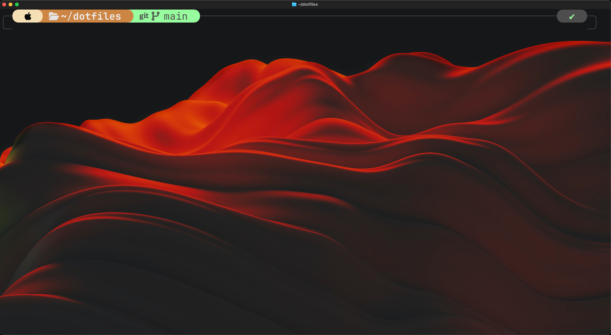

## This is the ReadME. Wow ##

I just wanna keep my config files, updated so if one day I lose my laptop, I can install everything once again. Thats all.

## Here are a few of the tools/applications i'm using (not exhaustive):
* Ghostty (Terminal Emulator) // goated
* Oh My ZSH
* Power10K 
* Aerospace (Tile Manager) // This is goated ngl
* Yazi (Navigating Files) // think cd but more visually appealing
* TMUX (Terminal Multiplexer) // allows you to have multiple terminals open at once

That's it. lolz

